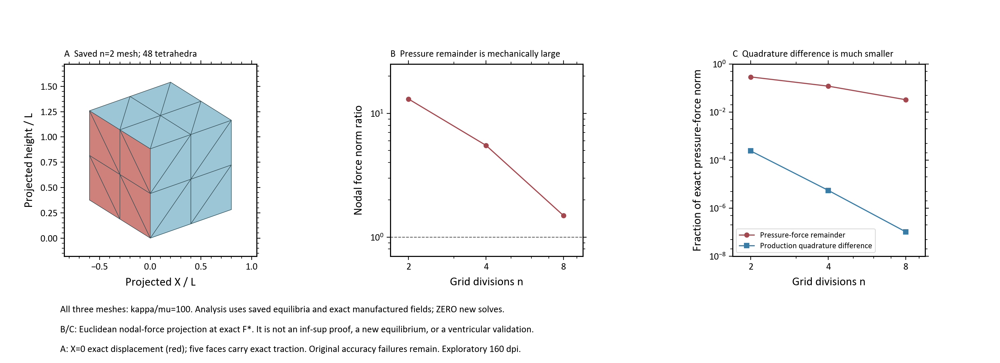

# PRL｜斑马鱼心室 FEM

## 目标与当前模型

用FEM研究斑马鱼心脏发育与心动、血流相互作用，不恢复DCM。
先理想化三维及公开资料，后续替换自有实验；几何和材料尚未用morphoHeart/自有实验标定。
路线：三维固体 → 规定式生长 → 双向FSI → 力学生长/ECM反馈。

主研究模型是心内膜/ECM/心肌三域半椭球心室：有限变形NH，P2位移/P1压力四面体；
基底环全固定、外壁自由、内腔随动压力；μ=1、κ=1000未标定。
原局部体积最大偏差1.4496%仍超1%门，三维主动、生长及FSI尚未运行。

## 本轮进展：已把排查重点收窄到压力载荷表示

**保存态诊断passed，原混合离散数值资格仍failed。没有新增FEM求解。**

当前用单位立方体制造解检验该离散：X=0准确位移，其余五面准确牵引及配套体力。
κ=100最细网格原位移H1误差43.65%仍超15%门；高κ粗网格正J保护有效，但仍无法收敛。

- 相同精确形变下，P1压力无法平衡的压力载荷分量占比随n=2/4/8为29.13%/12.04%/3.27%。
- 这些分量的节点力范数分别为精确等容力的13.05/5.50/1.49倍。
- 最细网格生产载荷积分差约3.44e−9，压力力余量约1.09e−3，约相差32万倍。
- 42项针对性测试、派生数组读回和639个源/保护文件哈希检查通过。
- 本轮80.126秒离线分析、0平衡求解、0 Docker、0 GPU；没有放宽任何原科学门。

这里的投影是固定网格与解析F*下的节点力欧氏投影，不是压力场百分比或inf-sup证明。
这支持优先检查“压力近似引起位移偏差”，尚不能证明原心室的最终根因。

[专家在线摘要、数据和代码](docs/review/mixed_cube_load_diagnosis_v01_20260919/README.md) ·
[实际执行记录](project_control/ventricle_mixed_cube_load_diagnosis_v01.md) ·
[原v03失败与正J保护](docs/review/mixed_cube_benchmark_v03_20260919/README.md)

## 当前阻断与唯一下一步

**一次四工况控制批次：一个可精确表示的非均匀体积patch，以及三个网格的非均匀等体积剪切。**

固定κ/μ=1000、当前P2/P1、本构与正J保护。它能区分压力载荷表示问题与更广泛的实现问题。
[完整范围与停止规则](project_control/ventricle_mixed_cube_control_batch_v01.md)已获用户整批确认。
两个解析控制场已实现、65项宿主测试passed。用户另行批准的一次Docker正常启动已失败：
Ingest初始化时旧`sailor-ingest.sock`不可访问，backend报告崩溃；五个套接字ACL读取error1920。
0容器、0求解，四工况仍not_run；不是本次FEM或材料失败。详见[执行记录](project_control/ventricle_mixed_cube_control_execution_v01.md)。
正常启动权限已用完；下一步需单独裁决运行环境恢复方式。本次未修复、隔离、删除或改权限。
已将启动前1920检查固化为[可复用技能](project_control/docker_windows_runtime_skill_delivery_v01.md)，
16项测试及安装核验通过；实机仍blocked，未新增启动或求解。
原四工况配置不变，待运行环境就绪后续行；
不逐个工况拆审批，不自动重跑、换单元或跳到原心室主动/生长/FSI。
新控制不能替代原八工况失败，也不能将原心室改判通过。

## 证据与存储

结果在已批准PRL-results；仓内仅源码、摘要和必要原样PNG。完整原始状态不上传，在线摘要不能替代复算。
本次包29文件、1104018 bytes；[小型清单](project_control/result_index/mixed_cube_load_diagnosis_v01_20260919.json)。
160dpi探索图布局/目检passed，600dpi投稿检查失败照录；首次log刻度显示失败与原绘图源码保留。
50项既有未提交改动保持；无删除、安装或全局记忆更新。
阶段交付检查后提交main并普通推送origin/main，见[长期规则](project_control/main_branch_stage_push_decision_v01.md)。

[专家原件](plan/active/EXP-20260918-FEM-review-v01/README.md) ·
[权威状态及历史](project_control/CURRENT_STATUS.md) ·
[驾驶舱（本机渲染）](memory/project_cockpit/index.html)
