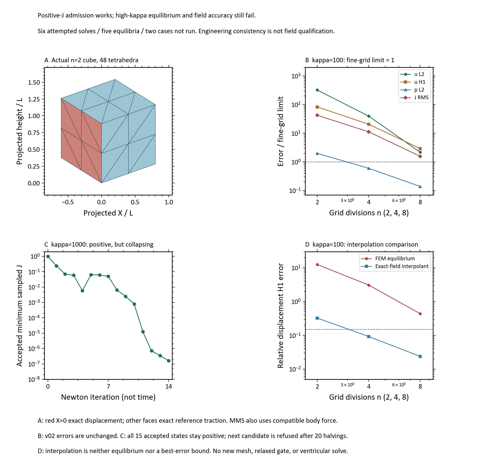

# 最新阶段审阅｜混合有限元立方体基准 v03

日期：2026-09-19。科学源码与阶段记录基于提交 `80a2236e2a144a77f201a7def1e1c7d316ee898b`。
本页为冻结结果的小型在线摘录；不是一次新计算，也不是完整原始数据包。

## 结论与当前模型

**正J候选步保护的工程核验passed，但场精度和高κ粗网格平衡仍failed。**

项目目标仍是三维心室发育与心动/双向流固耦合。当前先检验所用混合FEM的基础资格，
不能将单位立方体基准当作心室收缩或生物学验证。
单位立方体采用三维有限变形Neo-Hookean材料、P2位移/P1压力四面体，μ=1、κ=100/1000；
X=0面施加解析位移，其余五面施加解析参考牵引，制造解配套体力。没有主动收缩、生长或流体。
原三域半椭球心室的局部体积最大偏差仍为1.4496%，未通过原1%门。

## 核心结果

| 检查 | 结果 | 裁决 |
|---|---|---|
| 两个非零patch | 再次通过；旧表达式接口错误未复现 | passed |
| 正J候选保护 | 31条接受路径独立驻点核验通过，37个监测状态读回一致 | passed，仅采样安全核验 |
| κ=100，n=8位移L2 | 4.3239%，原门2% | failed |
| κ=100，n=8位移H1半范数 | 43.6485%，原门15% | failed |
| κ=100，n=8压力L2 | 2.0733%，原门15% | passed，仅此指标 |
| κ=100，n=8 J误差RMS | 0.15618%，原门0.1% | failed |
| κ=1000，n=2平衡 | 14个接受步后min J≈1.62×10⁻⁷；下一候选减半20次仍不安全，停止 | failed |
| κ=1000，n=4/8 | 首失败停止，没有继续运行 | not_run |

一次单CPU容器72.04秒，0 GPU、禁网；6次SNES尝试、5个有效平衡终态，无自动重跑。
54项宿主测试通过不改变上表的科学裁决。

A为真实参考网格及边界示意；B将误差除以原门限，虚线1表示门限；
C为高κ粗网格初始态及14个接受Newton状态，横轴不是生理时间；
D对比相同网格上的平衡解与解析位移P2插值。n=8插值H1误差2.3785%，平衡解为43.6485%。
这提示表示能力不是唯一问题，但插值不是平衡解或最佳逼近下界，不能据此断言锁死或inf-sup失稳。
空间采样正J不等于全域正性/全局单射；接近退化也不等于可接受的形变。
本图为已认可160dpi探索图原样副本，不是投稿终稿。

## 给专家的核查入口

- [完整阶段裁决与下一步](../../../project_control/ventricle_mixed_cube_benchmark_v03.md)
- [制造解与边界定义](../../../src/prl/fem/mixed_cube_spec.py)
- [原生求解器](../../../src/prl/fem/fenicsx_mixed_cube.py) / [候选步保护](../../../src/prl/fem/positive_j.py)
- [独立场验证](../../../src/prl/verification/mixed_cube.py) / [独立路径验证](../../../src/prl/verification/positive_j.py)
- [相关测试](../../../tests/prl/test_positive_j.py) / [基准测试](../../../tests/prl/test_mixed_cube.py)
- [完整包索引](../../../project_control/result_index/mixed_cube_benchmark_v03_20260919.json) / [本页图件来源与哈希](source_manifest.json)

代码链接随main更新；本次冻结源码版本请以顶部提交号为准。
唯一下一步是先从保存态区分制造载荷积分与混合压力约束的误差放大，再决定必要的新对照。
原材料、门限和失败保留，不直接推进三维主动、生长或FSI；本次没有新增运行权限。

## 原始证据可用性

完整原包在本机已批准结果库：
`E:\Temp-Projects\PRL-results\ventricle_fem\mixed_cube_benchmark_v03_20260919`。
原包205文件、17568141字节，manifest列出204个载荷文件；
manifest SHA-256为 `084a675f13501added2e056f5bc3cca125a2298f09d290240282fc2b570b77b0`。
本页仅收录摘要、PNG和来源记录，原始数组未上传GitHub。
**仅克隆仓库可审阅源码和上述结果，不足以独立复算全部保存态**；完整复核仍需取得该冻结原包。
