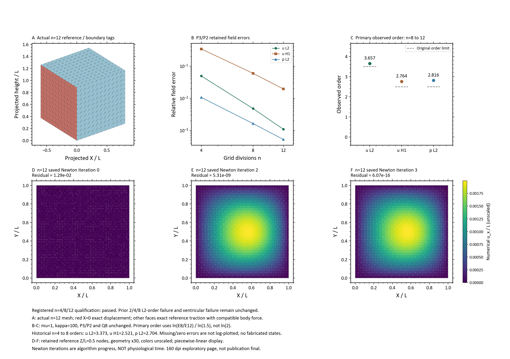

# 同载加密达到原L2阶次门；κ100基准与心室资格严格分开

执行依据：[用户续行后的事前固定合同](ventricle_mixed_cube_refinement_v01.md)。
只新增P3/P2 n12一次求解，复用冻结n4/n8；主要网格对在新结果之前固定为8→12。
μ=1、κ=100、原制造解、五面参考牵引/配套体力、X=0位移、Q8、有限变形NH和求解设置不变。
没有更换材料、降低门限、热启动、重跑P3/P1或运行n16。

## 这个问题的答案

原n4→n8位移L2阶为3.37274，未达到3.5；加密后的n8→n12为3.65707，达到同一门限。
新的4/8/12序列三项误差逐级下降，n12绝对误差门均过，H1及压力阶次也过原门。
这支持“此前较粗网格尚未达到该经验阶次门”，与加密后趋向渐近区相容；
不能据一个新网格对证明普遍四阶收敛、inf-sup稳定、完全无锁死或唯一误差根因。
此前针对边界带的保存态分析仍有效，本次也没有以剔除边界点或改统计区域得到通过。

## 实际误差与原门

误差以百分比显示，J RMS为无量纲误差乘100。H1是位移梯度半范数。

| 项目 | n4 | n8 | n12 | n12原绝对门 |
|---|---:|---:|---:|---:|
| 位移L2相对误差 | 4.961989% | 0.479026% | 0.108738% | ≤2% |
| 位移H1相对误差 | 34.363110% | 5.986898% | 1.952119% | ≤15% |
| 压力L2相对误差 | 1.067291% | 0.163785% | 0.052282% | ≤15% |
| J误差RMS | 0.124098% | 0.022081% | 0.007234% | ≤0.1% |
| 混合DOF | 7,320 | 51,788 | 167,584 | — |
| 原生求解秒 | 4.581 | 46.843 | 234.155 | — |

| 阶次 | 历史4→8 | 主要8→12 | 原门 | 新窗口裁决 |
|---|---:|---:|---:|---|
| u L2 | 3.372742 | 3.657068 | ≥3.5 | passed |
| u H1 | 2.520980 | 2.763883 | ≥2.5 | passed |
| p L2 | 2.704074 | 2.816283 | ≥2.5 | passed |

使用ln(E8/E12)/ln(1.5)，不是错误地除以ln2。描述性4→12平均L2阶为3.477678，
完整保留，但它不是事先指定的主要网格对，不用它替换主要裁决；同样不追认旧2/4/8通过。

## 执行、成本与独立性

1个现有固定镜像容器、1次SNES、3次Newton更新、329.842秒容器总耗时，0自动重试、0GPU。
全程单CPU/8GiB，实际进程累计峰值RSS5,569,249,280bytes（5.18677GiB），无OOM。
RSS是截至保存元数据时的进程高水位，不是覆盖随后全部审计过程的隔离单例峰值。
最终自由残差6.07e−16、采样minJ=0.99335315；这不是全域单射证明，也不能替代误差资格。

与冻结v03逐字段比对科学/求解设置，7份关键原生/材料/保护/导出/重建/运行时源码逐字节一致。
新增的是n12网格登记、非等比网格的独立收敛计算和交付接口，没有修改有限元方程。
607保护文件、50项无关旧改动、38份执行源码快照前后保持；原始失败包未写回。
启动前109项宿主回归通过。最终独立路径、6/8点误差积分及图件验收记录另列于下方。

原生前置插值态F/J差4.44e−16、体力差3.33e−15、节点力差7.97e−18、切线方向差3.72e−10。
不存在以放宽接口误差门使本次通过的操作。

## 交付与验证

完整结果根：`E:\Temp-Projects\PRL-results\ventricle_fem\mixed_cube_refinement_v01_20260919`。
4个真实接受态（Newton 0/1/2/3）、3条更新路径全部独立通过，未使用端点补证来豁免路径失败。
独立重建n4/n8引用和n12新终态与保存数据一致；更密的8点每轴积分/J安全复核通过。
6/8点误差积分的u L2/H1/p L2绝对差分别为2.31e−13/4.62e−15/1.49e−13。
路径原检查全部passed，不需要增加减半上限或改容差。
结构/误差/真实状态诊断页、完整冻结信息见最终验证记录；图件不替代上述独立数值检查。



图件Notebook执行、目检、最终冻结passed；首轮横轴次刻度标签拥挤的视觉failed记录保留，
仅关闭次刻度文字后重新执行、目检通过，未改变数值或轴框。显示Newton 0/2/3，全部4态原始数据保留；
几何显示放大30倍，颜色不放大，不称生理时间。
沿用160dpi探索例外；通用600dpi投稿检查仅两项分辨率failed照录，不冒充投稿终稿。

[数值摘要](evidence/mixed_cube_refinement_v01/numerical_summary.json) ·
[最终交付核验](evidence/mixed_cube_refinement_v01/validation.json) ·
[173项工程回归](evidence/mixed_cube_refinement_v01/tests_final.json) ·
[结果索引](result_index/mixed_cube_refinement_v01_20260919.json)。

冻结包111文件、109,351,925 bytes（约104.29MiB），manifest SHA-256：
`2407580b18fe65f7c735a638e7ee11d184dc31470aa291058313c73daf6bd40c`。
冻结时仓库2,049,773,598 bytes（约1.91GiB），低于3GiB；旧reparse points未跟随或处理。
临时绘图缓存`.render_runtime`和`07_ai_files/FigR3_mixed_cube_refinement_v01_20260919_runtime`
均在本结果根内、记录任务所有权并计入总量；没有删除授权，未清除任何目录。

复算入口（已有包只读，不重启FEM）：

```powershell
$env:PYTHONPATH='E:\Temp-Projects\PRL\src'
$env:PYTHONDONTWRITEBYTECODE='1'
$env:OPENBLAS_NUM_THREADS='1'
F:\python\python.exe -B -X utf8 -m prl verify fem-mixed-cube --batch refinement_v01
```

上述命令复算状态/误差；完整路径审计另见包内`path_readback.json`及源码。
完整原始数组未同步Git，专家可在线读取本页、小型数值摘要、预览和可复核源码；
仅克隆Git不能冒充已经取得完整原始状态。

## 下一步与不能越过的边界

本次通过的资格范围仅为**原MMS、κ/μ=100、P3/P2、Q8、固定4/8/12窗口**。
κ1000的可表示patch通过不是非可表示MMS通过；原心室κ1000的1.4496%局部体积偏差仍超1%门。
唯一下一科学问题是将同一候选提升到κ/μ=1000的近不可压资格，随后才做受控薄层鉴别及同载心室回归。
κ变化时兼容的制造压力、体力和牵引也随之改变；这是高κ数值资格，不是固定外载荷的锁死对照试验。
这三者不是本次自动授权的新计算；未运行心室主动、连续生长、双向FSI或DCM。

没有启动/修复Docker Desktop、安装/拉取/升级、删除文件或创建外部评审包。
Docker首次镜像查询超时对应idle唤醒；日志确认VM已启动后有界查询与实际容器验收通过，
活跃socket ACL1920没有被误判为新的损坏或触发修复。
