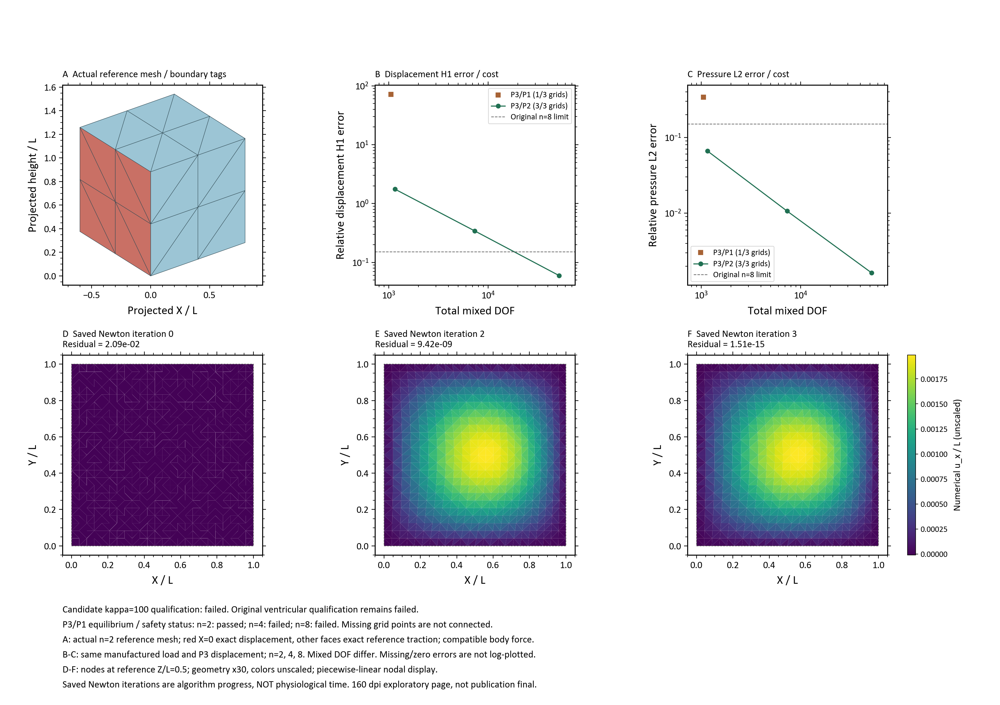

# 同载离散对照完成：原生P3接口修好，场误差大幅下降，但完整收敛资格仍差一项

本轮按[用户里程碑授权](ventricle_mixed_cube_representation_milestone_v01.md)连续处理同一问题，
不再逐次小修补请求审批。原[八工况科学合同](ventricle_mixed_cube_representation_batch_v01.md)的材料、
载荷、边界、积分、网格和门限不变。没有运行心室主动、生长、FSI或DCM。

## 已经解决和仍未解决的事

1. **P3节点方向导出错误已完成原生复验。** 不只是宿主单元测试：修正后真实FEniCSx表达式、映射、装配、切线前置检查通过，可表示的非零P3/P2 patch达到原误差门。
2. **提高积分阶次不能解决原P2/P1大位移误差。** 同一n8网格由生产Q6改Q8后，H1误差仍43.6485%。
3. **P3/P2改善了同一原制造解。** n8的位移L2/H1、压力L2及J误差RMS均达到原绝对门；不是更换容易的解析场、软化材料或改载荷得到的结果。
4. **不能称P3/P2完整资格通过。** 位移L2末两级收敛阶3.37274，低于预注册3.5；另外两项阶次通过。原门保持failed，不因差距较小而改判。
5. **仅提高位移阶次的P3/P1不能用于当前主线。** n2虽满足离散平衡但误差极大，n4/n8停滞并触发正J路径保护；不能把低残差或部分正J当作场正确。

## 当前验证模型

单位立方体、仿射四面体、有限变形NH混合位移/压力形式；μ=1。
X=0施加解析位移，另五面解析参考牵引P*N，并施加配套体力−Div(P*)。
七个MMS均为u*=(0.002sinπXsinπYsinπZ,0,0)、κ=100、p*=κ(J*−1)；每例零初值。
P3/P2 patch单独采用可精确表示的u*=(0.002X³,0,0)、κ=1000。
这不是心室、心动周期或实验验证；Newton迭代不代表生理时间。

## 数值结果与成本

相对误差以下以百分比表示；J RMS为无量纲误差乘100。H1指保存实现的梯度半范数。

| 工况 | n | DOF | u L2 | u H1 | p L2 | J误差RMS | 原生求解秒 |
|---|---:|---:|---:|---:|---:|---:|---:|
| P2/P1 Q8 | 8 | 15,468 | 4.32387% | 43.64849% | 2.07330% | 0.156181% | 12.5870 |
| P3/P1 | 2 | 1,056 | 3368.943% | 7114.803% | 33.85973% | 23.93030% | 3.2689 |
| P3/P1 | 4 | 6,716 | null | null | null | null | 失败保全 |
| P3/P1 | 8 | 47,604 | null | null | null | null | 失败保全 |
| P3/P2 | 2 | 1,154 | 51.93580% | 175.72312% | 6.62974% | 0.604936% | 0.7665 |
| P3/P2 | 4 | 7,320 | 4.96199% | 34.36311% | 1.06729% | 0.124098% | 4.5806 |
| P3/P2 | 8 | 51,788 | 0.47903% | 5.98690% | 0.163785% | 0.022081% | 46.8425 |
| 原n8绝对门 | — | — | ≤2% | ≤15% | ≤15% | ≤0.1% | — |

| P3/P2阶次 | n2→n4 | n4→n8 | 原末两级门 | 判定 |
|---|---:|---:|---:|---|
| u L2 | 3.38774 | 3.37274 | ≥3.5 | failed |
| u H1 | 2.35437 | 2.52098 | ≥2.5 | passed |
| p L2 | 2.63500 | 2.70407 | ≥2.5 | passed |

patch：u L2=6.10e−11、H1=2.28e−10、缩放p L2=8.00e−14、max|J−J*|=3.82e−12、逐面力误差1.79e−13，全部过原门。
P3/P2 n8的进程累计峰值RSS约1.30GiB；这不是隔离测得的单例峰值。
同n8 P3/P2相对P2/P1使用约3.35倍DOF、约3.72倍本次求解耗时；不是等DOF效率胜出证明。

## 两次执行和失败保全

- v02：1容器、5次SNES，4终态；在P3/P1 n4的第28条方向耗尽20次减半，PETSc101。容器123.066秒，无OOM。
- v03：[只续三个尚未启动工况](ventricle_mixed_cube_representation_v03_continuation.md)，候选n4/n8先运行；P3/P1 n8在第15条方向同类停止。1容器、3次SNES、2终态，346.436秒，无OOM。
- 合计2容器、8次SNES、6终态、2失败，0自动重跑、0GPU；不是把一次授权无限循环复用。
- 原v01接口失败包仍保留；v02原执行225文件/31,624,379bytes先冻结，再启动v03。
- 两次均为单CPU/8GiB、固定本地镜像、禁网、只读项目、1800秒上限；未启动、修复、安装、更新或拉取Docker。

v02独立诊断确认：最后接受态J最小0.420480；方向范数增至1.02e6；21个允许步长的真实终点均有非正J。
最小允许步2^-20仍有16个非正样本，最小J=−0.269889；失败方向没有被接受。
只读的2^-21探测可正，不等于允许放宽原20次限制，也不保证残差收敛。
[可复算安全拒绝证据](evidence/mixed_cube_representation_milestone_v01/guard_failure_diagnosis.json)。

v03 n8同样独立确认：最后接受态J最小0.875992，方向范数1.77e6，21个允许端点均非正；
2^-20端点最小J=−15.72060、286个非正样本，独立路径拟合差1.42e−14。
[n8拒绝证据](evidence/mixed_cube_representation_milestone_v01/guard_failure_diagnosis_v03.json)。
诊断脚本随后泛化为同一入口；旧n4诊断所用源码原样保存在v02的`diagnostic_sources/representation_guard_diagnosis.py`，
SHA-256=`aec94b4eaaee`开头，与旧JSON完整记录一致；不是拿新源码冒充旧运行版本。

## 独立读回与失败分层

- 6个终态独立方程/映射/安全读回通过；全部81个接受态及75个保存候选方向保留。
- 审计73条获准方向/接受步。六个完成病例的自身路径资格通过；不以整包状态替代逐病例判定。
- 原整包路径审计仍failed：P3/P1 n4的sequence19–27及n8的9/10/11/13/14，共14项未缩放候选全步`native_kinematics`一致性检查失败，原门与原记录保持。
- n2诊断控制另有一次极小更新的比例读回失败；保存端点与`current−scale*direction`逐位相同补证通过，不增加容差。
- 因失败控制仍存在，`delivery_integrity`总状态failed；`delivery_integrity.json`的passed仅表示输入字节/哈希保全。不能将两者混为全科学通过。
- 跨病例路径耦合已修正：不再因另一个失败控制而阻断已逐项复核的patch/candidate，失败控制自身的14项检查没有被放过。

每个终态均以6点和8点每轴Gauss-Duffy独立误差积分复核，所有终态8点J采样为正。
候选n8相对u L2/H1/p L2的两积分绝对差为3.38e−12/9.66e−14/2.51e−12；
因此L2阶3.37274的缺口不是本次误差积分6点不足所致。

原Q6与新Q8的P2/P1 n8坐标/拓扑对齐后，位移节点向量相对差2.8787e−7，压力1.2058e−8。
这些是节点Euclidean范数，不是场积分L2；该控制仅改变生产积分，支持排除“原大误差主要由Q6积分不足造成”。

135项相关宿主回归通过；这是工程回归，不替代上面的科学failed。

## 剩余L2缺阶的保存态定位

固定物理区域（事先写定宽0.125L）的离线积分复算与原全域L2结果最大差4.44e−16。
n8时外边带占57.8125%体积，却只占49.0865%误差平方；X<0.125L的固定端邻带占12.5%体积、6.4232%误差平方。
内部补集已占50.9135%误差平方，末级L2阶3.22767，低于外边带的3.49759。
因此目前不支持把全局L2缺阶主要归咎于边界误差集中；仍不能单凭分区确定唯一机制。

区域按积分点mask近似，未对跨区单元精确切割；n2外边带体积分数低估0.4991个百分点，
区域阶次只作描述性定位，不替代原全域门。
[完整数值及输入哈希](evidence/mixed_cube_representation_milestone_v01/error_localization.json) ·
[可复算脚本](evidence/mixed_cube_representation_milestone_v01/error_localization.py)。

## 证据边界与唯一下一步

P3/P1 n4/n8没有合格平衡态，因此三网格完整配对的“压力表示贡献”保持unknown；
P3/P2明显改善是本次观测，不是唯一根因、inf-sup稳定性、无锁死或生物有效性的证明。
原心室κ1000、1%局部体积门仍failed，不能由κ100立方体通过若干指标越级替换。

下一科学动作应只判别**剩余L2收敛阶缺口**：先分析保存态误差的空间分布及边界贡献，再登记必要的加密对照和资源方案。
不能直接再改材料/降低门限，也不能把这次κ100结果当成κ1000或心室资格。
本轮未登记的更大网格、κ1000矩阵或应用接口更换不自动启动。

全部原summary、配置、日志与失败文件不改写；图件、最终保全及复算入口见下方交付段。

## 交付、图件和保全验收



图A为真实参考立方体及边界；B/C为实际误差—DOF；D–F为P3/P2 n8的真实Newton 0/2/3状态，
几何显示×30，颜色不放大。全部81态保留，展示采样不替代原始验证。
Notebook、数值/样式快照、PNG/SVG自动执行、目检和冻结通过。
初次参数命名缺项及页脚间距检查失败保留；补齐FIGURE_SIZE_IN/DPI、增加0.5英寸底部间距后重验通过，未改任何数值。
160dpi探索图沿用已采纳例外；通用600dpi投稿检查仅分辨率failed照录，不冒充投稿终稿。

| 包 | 文件数（含manifest） | 逻辑bytes | manifest SHA-256 |
|---|---:|---:|---|
| v02 | 228 | 31,715,878 | `152416a7709b0f485b97e94a53ff4598f4b00b4d66339b7f84bdd9c41abb2a5f` |
| v03及汇总图件 | 170 | 77,610,505 | `61550554e2534bcfaadfe8ac9ec3e3218e33275a5a81d5ab110758b53c28de28` |

[v02结果索引](result_index/mixed_cube_representation_v02_20260919.json) ·
[v03结果索引](result_index/mixed_cube_representation_v03_20260919.json) ·
[数值摘要](evidence/mixed_cube_representation_milestone_v01/numerical_summary.json) ·
[保全与交付检查](evidence/mixed_cube_representation_milestone_v01/validation.json)。
完整数据根为`E:\Temp-Projects\PRL-results\ventricle_fem\mixed_cube_representation_v0{2,3}_20260919`，
此处花括号仅作两个既知包的文字简称，不是文件操作目标。
最终数据包不再写回；复算时用新派生输出位置，不重启FEM或覆盖manifest。

v03运行后1121保护文件、50项无关旧改动及36份执行源码快照通过；汇总再次核验两个包的全部保护文件和源码快照。
冻结时项目2,047,557,348bytes（约1.91GiB），低于3GiB；旧reparse points统计跳过、未跟随或处理。
无文件删除、无额外评审包。原有未跟踪评审资料未修改或纳入提交。
绘图运行暂存留在v03的`.render_runtime`与`07_ai_files`，未经精确删除授权不自动清除，且计入包大小。

复核（只读，不调用Docker）：

```powershell
$env:PYTHONPATH='E:\Temp-Projects\PRL\src'
$env:PYTHONDONTWRITEBYTECODE='1'
$env:OMP_NUM_THREADS='1'
$env:OPENBLAS_NUM_THREADS='1'
F:\python\python.exe -B -X utf8 -m prl.verification.representation_guard_diagnosis 'E:\Temp-Projects\PRL-results\ventricle_fem\mixed_cube_representation_v03_20260919'
F:\python\python.exe -B -X utf8 project_control/evidence/mixed_cube_representation_milestone_v01/error_localization.py
```

`src/prl/runs/mixed_cube_representation_delivery.py`实现逐包终态/路径/积分读回与全矩阵汇总；
`merge_analyses`只允许原样配置的已登记工况，重复启动需显式来源选择且保留所有attempt。
现有冻结包不再调用create-only交付入口；保留的Notebook从包内物理快照绘图，不依赖本机源码路径。
